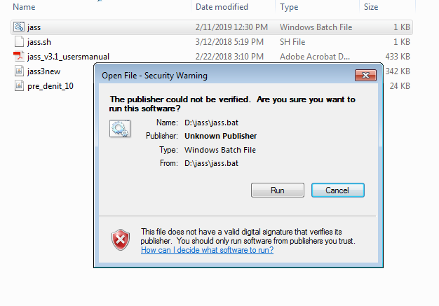
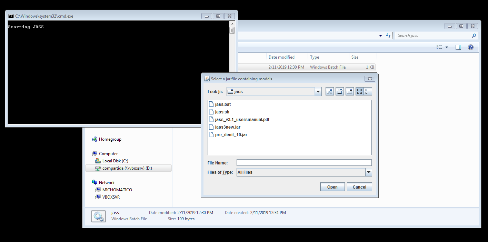
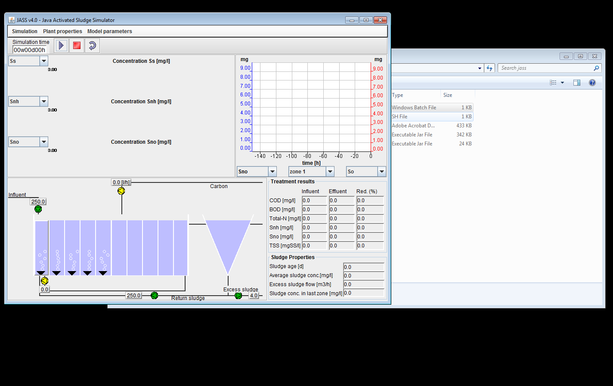
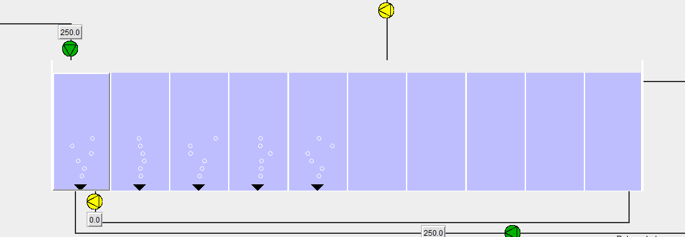
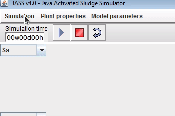
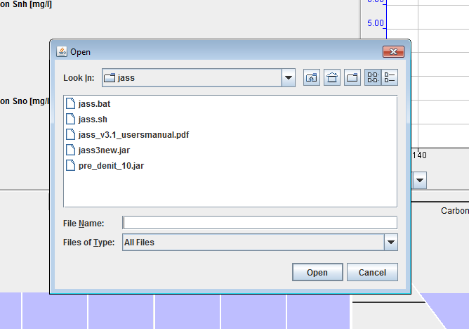
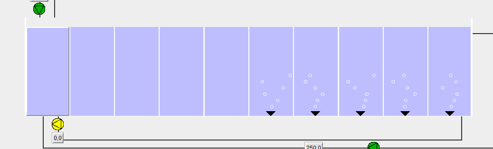
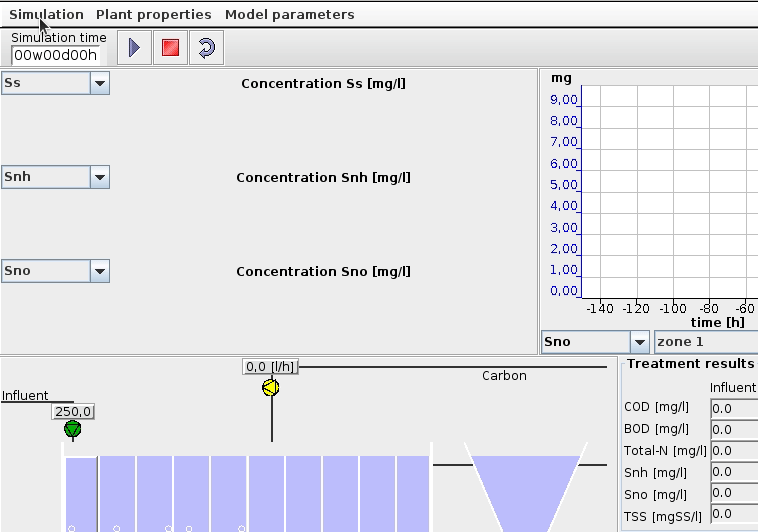
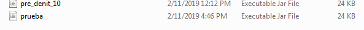
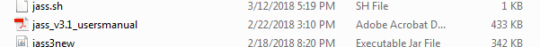

# JASS! a Java based Activated Sludge process Simulator working on Windows or Linux

Instrucciones de como usar el simulador JASS tanto en entornos Windows como en Linux.

## Como usar JASS en Windows

1.- Descargar el archivo [jass.zip](./file/jass.zip)

2.- Descomprimir en el ordenador. 


3.- Hacer doble click sobre el archivo jass


4.- Si aparece un mensaje de alerta, clickar sobre `Run`



5.- Aparecerán dos ventanas, una consola de Windows con las palabras `Starting JASS` y otra ventana que nos solicita que ingresemos los modelos. Sobre esta última presionar `Cancel` 



6.- Debería abrirse el simulador



7.- En este momento tendremos arrancado el simulador pero con una configuración de planta por defecto. Podemos ver esto ya que por defecto aparecen los tanques 1 al 5 con flujo activado.



8.- Deberemos cargar la configuración de planta que necesitamos, `pre_denit_10`. Para ello vamos a la opción del menú `Simulation`, `Load Plant Setup` y `From file`.



9.- Desde la ventana de selección archivos, seleccionaremos nuestro configuración de planta `pre_denit_10.jar`



10.- Veremos que el la configuración del simulador cambia y los tanques donde ahora hay flujo serán los del 6 al 10



Ahora ya tendrás el simulador con la configuración necesaria cargada.

## Como usar JASS en Linux

El programa JASS está realizado en Java por lo que su ejecución es posible tanto en entornos Windows como Linux. Para ejecutar el simulador en Linux, realiza los pasos 1 y 2 descargando y descomprimiendo el archivo. Abre una consola de Linux y navega hasta la carpeta que has descomprimido. Desde allí ejecuta:

```bash
$ ./jass.sh
```

Si no se ejecuta es posible que tengas que asignarle permisos de ejecución al archivo. Para ello, desde la misma carpeta ejecuta:

```bash
$ chmod u+x jass.sh
```

El resto del flujo de trabajo desde los pasos 5 serán similares.

## Como grabar configuraciones

Usando aplicación usada desde el escritorio tal y como se documenta aquí, se pueden grabar tanto los progresos como nuevas configuraciones de planta. Para ello definiremos los parámetros en la planta cambiando los valores de los componentes como deseemos. Una vez que tengamos la configuración definida iremos a `Simulation`, `Save plant setup` lo que nos abrirá una ventana de archivos. 



Definiremos el nombre con el que queremos guardar nuestra configuración y pulsaremos sobre `Guardar`. 

> **IMPORTANTE** Deberemos poner la extensión `.jar`en el archivo para que el programa lo reconozca como un archivo válido cuando queramos usar esta configuración.

Una vez guardado veremos que tenemos un nuevo archivo `prueba.jar` (en este caso *prueba.jar* es un ejemplo de nombre) en la carpeta que hayamos seleccionado para guardarlo



Para cargar nuestra configuración simplemente volveremos a realizar los pasos 8 y 9.

## Documentación

Dentro del archivo `jass.zip` podréis encontrar la documentación del simulador.



## Referencias

[Página web del JASS](http://www.it.uu.se/research/project/jass/)
